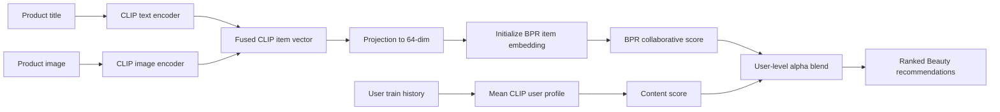

# Amazon Beauty Product Recommender

This project studies Beauty product recommendation on [Amazon Reviews 2023](https://amazon-reviews-2023.github.io/) from [McAuley-Lab/Amazon-Reviews-2023](https://huggingface.co/datasets/McAuley-Lab/Amazon-Reviews-2023), a 571.54M-review dataset spanning 1996 to 2023 and grouped by product category.

72% of Beauty shoppers have fewer than 5 reviews in the category, most users are cold (fewer than 10 reviews), and the Beauty user-item matrix is approximately 99.9998% sparse.

Contributors: @nginyc, @j0kene, @gabrielmsidik, @frankwang0113, @Yuds16

## Approach

The project explores whether collaborative filtering improves when item representations are enriched with semantic, visual, and adjacent-category signals.

`Beauty and Personal Care` is treated as the target domain, while `Clothing, Shoes and Jewelry` is used as an adjacent source domain for cross-category training signal. The experiments compare popularity, collaborative filtering, graph-based, text-embedding, multimodal, and cross-category hybrid recommenders under a temporal train/validation/test split.

- **Cross-category reviews**: Clothing interactions provide additional source-domain interactions for users who also appear in Beauty.
- **Visual item content**: Product image embeddings provide item content features.
- **Text item content**: Product titles are encoded as semantic item representations.

The trained content-aware models in this repository focus on product titles and precomputed CLIP image embeddings.

## Methodology

The experiments use reviews from the configured 2021-2022 window:

| Domain | Role | Users | Products | Reviews |
|---|---|---:|---:|---:|
| Beauty and Personal Care | Target domain | 156.5K | 250.9K | 1.46M |
| Clothing, Shoes and Jewelry | Source domain | 125.2K | 102.0K | 876.0K |

Beauty data is used for train, validation, and test evaluation. Clothing data is used as additional source-domain training signal for the cross-category experiments.

### Warm/Cold Definitions

The project uses single-step filtering rather than iterative k-core pruning so that cold products remain available for evaluation.

| Variable | Value | Purpose |
|---|---:|---|
| `USER_MIN_REVIEWS` | 5 | Drop users with fewer than 5 Beauty reviews |
| `WARM_USER_MIN_REVIEWS` | 10 | Warm user if the user has at least 10 Beauty train reviews |
| `WARM_ITEM_MIN_REVIEWS` | 5 | Warm item if the item has at least 5 train reviews |
| `CLOTHING_MIN_TRAIN_REVIEWS` | 3 | Drop Clothing items with fewer than 3 train reviews in cross-category training |

### Evaluation

The recommender task is framed as top-K ranking for Beauty products, where K = 20. All evaluation is performed on temporally held-out Beauty interactions.

Temporal split:

- Train: interactions up to `2022-08-01`
- Validation: interactions after `2022-08-01` and up to `2022-10-01`
- Test: interactions after `2022-10-01`

Primary metric: `NDCG@20`

For the cross-category setup, training includes Beauty train interactions plus Clothing interactions from users with Beauty training history. Validation and test remain Beauty-only, and non-Beauty items are masked during target-domain evaluation.

## Models

### Collaborative Filtering Baselines

These models use user-item interactions only and establish whether learned collaborative filtering improves over a popularity baseline.

- `MostPop`: Non-personalized popularity baseline using global item interaction counts.
- `BPR`: Bayesian Personalized Ranking matrix factorization with pairwise ranking loss.
- `LightGCN`: Graph collaborative filtering model that propagates user/item embeddings over the interaction graph.

Pure collaborative filtering is a strong baseline, but it has a predictable limitation: item-cold products receive little or no training signal, so they are difficult to rank.

### Text-Only Content Models

- `Mean-Pool Title`: Encodes product titles with `BAAI/bge-base-en-v1.5`, represents each user as the mean of interacted item title embeddings, and scores candidate items by dot product. This can score cold items because every item has a content vector, but it has no learned collaborative filtering signal.
- `BPR-Init-Title`: Projects BGE title embeddings from 768 dimensions to the 64-dimensional BPR latent space, then uses those projected vectors to initialize item embeddings before pairwise BPR training.
- `LightGCN-Init-Title`: Applies the same title-initialization idea to LightGCN's layer-0 item embeddings.

The title-initialized models preserve the original collaborative filtering objective while replacing random item initialization with semantic item priors.

### Text + Image Models

`BPR-CLIP-Title-Image` uses CLIP title and image embeddings as multimodal item content. CLIP is useful here because its text and image encoders produce 512-dimensional vectors in a shared embedding space, so title and image vectors can be averaged directly and L2-normalized.

The model combines four techniques:

- Initialize trainable BPR item embeddings from a seeded projection of fused CLIP item vectors into the 64-dimensional BPR latent space.
- Compute a frozen user content profile as the mean of each user's interacted item CLIP vectors.
- Learn a per-user alpha parameter that controls the blend between collaborative and content scores.
- During full-sort evaluation, z-score collaborative and content score vectors per user before blending.

Scoring form:

```text
score(u, i) = alpha_u * BPR_score(u, i)
            + (1 - alpha_u) * Content_score(u, i)
```



`BPR-CLIP-Title-Image-Cross` extends the CLIP hybrid model with Beauty + Clothing training interactions. Beauty interactions are weighted `10x` relative to Clothing interactions, validation/test remain Beauty-only, and non-Beauty items are masked during target-domain evaluation.

## Experimental Results

All results below are `NDCG@20` on held-out Beauty test interactions. The segment tables are important because overall performance hides the main failure mode: item-cold recommendation.

### Overall Performance

| Model | Overall NDCG@20 | Key Readout |
|---|---:|---|
| MostPop | 0.006094 | Popularity baseline |
| BPR | 0.006808 | +11.7% vs MostPop |
| LightGCN | 0.0074 | Best pure collaborative filtering baseline |
| Mean-Pool Title | 0.003071 | Weak overall, but can score cold items |
| LightGCN-Init-Title | 0.0079 | Improves over LightGCN |
| BPR-Init-Title | 0.008456 | +24.2% vs BPR |
| BPR-CLIP-Title-Image | 0.009159 | Best Beauty-only model; +34.5% vs BPR |
| BPR-CLIP-Title-Image-Cross | **0.009319** | Best overall model; +36.9% vs BPR |

### Segment-Level Performance

| Segment | BPR | BPR-Init-Title | BPR-CLIP | Cross BPR-CLIP | Interpretation |
|---|---:|---:|---:|---:|---|
| User Cold | 0.006964 | 0.008598 | 0.009346 | **0.009563** | Cross-category training helps cold users |
| Item Warm | 0.010080 | 0.012627 | 0.013538 | **0.013836** | Cross-category CLIP hybrid is strongest on warm items |
| Item Cold | 0.000000 | 0.000000 | **0.000150** | 0.000137 | CLIP adds a small non-zero cold-item signal |
| User Warm x Item Warm | 0.009282 | 0.012116 | **0.012814** | 0.012439 | CLIP helps, while cross-category signal slightly hurts this segment |
| User Cold x Item Warm | 0.010198 | 0.012703 | 0.013645 | **0.014043** | Cross-category training helps cold users most clearly |
| User Warm x Item Cold | **0.000000** | **0.000000** | **0.000000** | **0.000000** | Still unsolved |
| User Cold x Item Cold | 0.000000 | 0.000000 | **0.000177** | 0.000161 | CLIP enables limited cold-item retrieval |

### Key Insights

1. Pure collaborative filtering beats the popularity baseline, but it does not recommend item-cold products effectively.
2. Title initialization improves both BPR and LightGCN, showing that semantic item priors help even when the training objective remains collaborative.
3. Mean-pool title embeddings underperform overall, but they demonstrate why content-only scoring can cover cold items.
4. CLIP title/image fusion is the strongest Beauty-only approach, improving overall `NDCG@20` by 34.5% over plain BPR and 8.3% over BPR initialized with BGE titles.
5. Cross-category training produces the best overall score and best cold-user score, but its segment-level gains are mixed.
6. Cold-user performance is often higher than warm-user performance. This is counterintuitive, but likely reflects popularity bias: cold users tend to interact with popular, high-density products, while warm users interact with more niche and long-tail products that are harder to predict.
7. Item-cold recommendation remains the hardest segment. CLIP-based content scoring creates a small but non-zero item-cold signal. Cross-category training helps cold users more reliably than it helps cold items.

## Setup

### Prerequisites

- **[pyenv](https://github.com/pyenv/pyenv)**
- **[uv](https://github.com/astral-sh/uv)**

### Installation

Install Python dependencies and set up the virtual environment:

```sh
pyenv install
pyenv exec python -m venv ./.venv
. .venv/bin/activate
uv sync
```

### Download Amazon Reviews 2023 Data

Download the Amazon Reviews 2023 data from the official project site:

- https://amazon-reviews-2023.github.io/
- https://huggingface.co/datasets/McAuley-Lab/Amazon-Reviews-2023

The site provides per-category `review` and `meta` downloads, plus links to the common data processing and loading guidance.

For Beauty-only experiments, download the **Beauty and Personal Care** review and metadata JSONL files and place them under `data/`. For cross-category experiments, also download **Clothing, Shoes and Jewelry** review and metadata JSONL files.

Raw data, generated embeddings, and model checkpoints are intentionally not included in this repository.

### Download CLIP Image Embeddings

Download the precomputed CLIP image embeddings from Google Drive: https://drive.google.com/drive/folders/1jkAkfQh-xtICmghAmU_53oRyiF3RTEFf?usp=drive_link.

Extract the multi-part zip archive into `data/embeddings/`:

```sh
mkdir -p data/embeddings
bsdtar -x -f ~/Downloads/embeddings-*-001.zip -C data/embeddings/
for f in ~/Downloads/embeddings-*-00{2,3,4,5,6,7}.zip; do
    bsdtar -x -f "$f" -C data/embeddings/
done
mv data/embeddings/embeddings/*.parquet data/embeddings/
rmdir data/embeddings/embeddings
```

**Expected format:** In `data/embeddings/`, each shard has columns `parent_asin` (str) and `embedding` (list of 512 floats, L2-normalized CLIP ViT-B/32 image embedding).

**Generating your own:** Run a CLIP model over product images for the `parent_asin` values in `data/items.csv`. You can refer to `research/clip_embedding_generation_script.ipynb` for an example of how these embeddings were generated.

## Pipeline

Run the notebooks in this order: preprocessing, atomic-file preparation, training, then optional demo. EDA notebooks can be run independently.

### 1. EDA

- `eda/eda_beauty.ipynb`: Explores Beauty review distributions, temporal splits, and warm/cold user/item segments.
- `eda/eda_clothing-beauty.ipynb`: Explores cross-category transfer potential between Beauty and Clothing.

### 2. Preprocess Reviews

Notebook: `preprocess/process-reviews-jsonl.ipynb`

Loads review JSONL files for Beauty and Clothing, filters to `2021-2022`, deduplicates user-item pairs, and writes `data/reviews.csv`.

### 3. Preprocess Item Metadata

Notebook: `preprocess/process-items-jsonl.ipynb`

Loads metadata JSONL files, keeps products that appear in the processed reviews, cleans selected metadata fields, and writes `data/items.csv`.

### 4. Prepare Beauty RecBole Files

Notebook: `preprocess/prepare-beauty-atomic-files.ipynb`

Creates Beauty-only RecBole atomic files under `data/beauty/`, including temporal train/validation/test interactions, user warm/cold labels, and item warm/cold labels.

### 5. Prepare Clothing + Beauty RecBole Files

Notebook: `preprocess/prepare-clothing-beauty-atomic-files.ipynb`

Creates cross-category RecBole atomic files under `data/clothing-beauty/`. The training set combines Beauty train interactions with Clothing source-domain interactions from overlapping users. Validation and test remain Beauty-only. The item file includes a target-domain label for Beauty vs Clothing, and the notebook saves CLIP image embeddings aligned to the cross-category item index.

### 6. Train Models

All training notebooks load prepared RecBole atomic files, train or evaluate a recommender, and report `NDCG@20`, `Recall@20`, and `MRR@20` overall and by warm/cold segments. Training notebooks may write local checkpoints under the configured RecBole checkpoint directory; checkpoints are not included in git.

- `train/train-pop.ipynb`: Most-popular baseline.
- `train/train-bpr.ipynb`: BPR collaborative filtering baseline.
- `train/train-lightgcn.ipynb`: LightGCN collaborative filtering baseline.
- `train/train-mean-pool-bge.ipynb`: Mean-pool BGE title content baseline.
- `train/train-bpr-bge-init.ipynb`: BPR initialized with projected BGE title embeddings.
- `train/train-lightgcn-bge-init.ipynb`: LightGCN initialized with projected BGE title embeddings.
- `train/train-bpr-clip-hybrid.ipynb`: Beauty-only BPR + CLIP title/image hybrid.
- `train/train-bpr-clip-hybrid-cross.ipynb`: Cross-category BPR + CLIP title/image hybrid trained with Beauty + Clothing interactions.

## Demo

`demo.ipynb` visualizes a trained `BPRClipHybrid` model by showing a sample user's interaction history, top-K recommendations, and held-out test items. It requires a locally generated compatible checkpoint.

## License

This repository is licensed under the MIT License. The license applies to the project code and notebooks. Amazon Reviews 2023 data is provided by McAuley Lab and is not redistributed in this repository.
